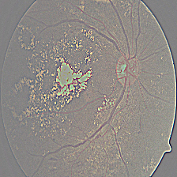
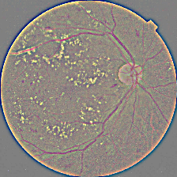
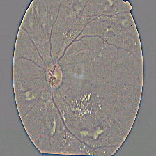
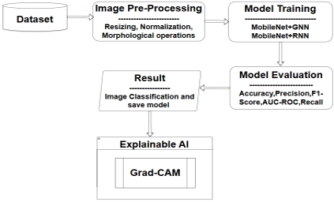
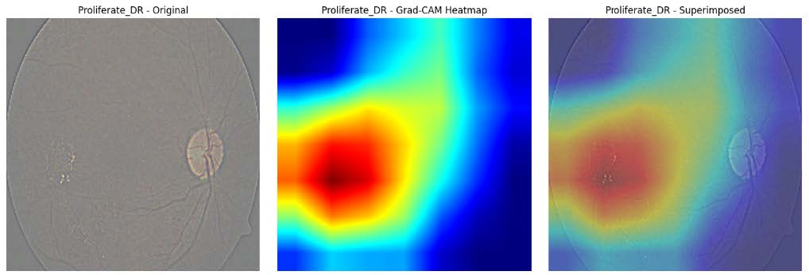
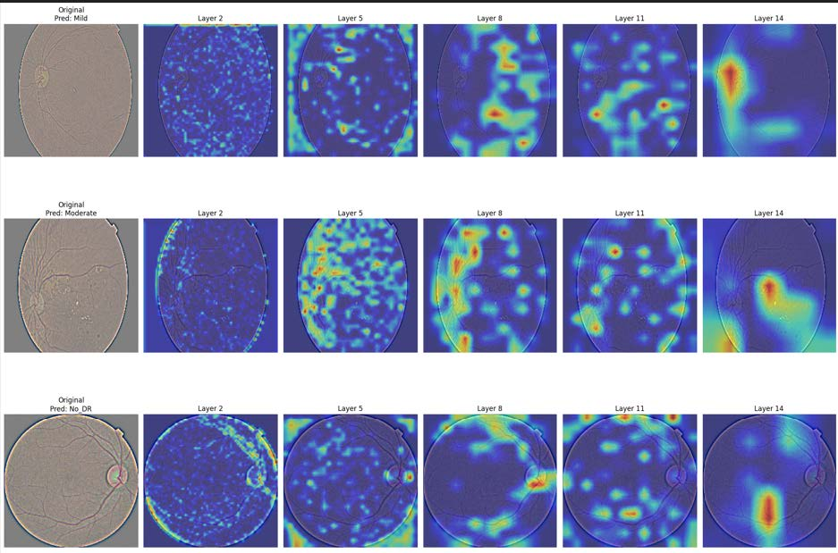

# Diabetic_Retinopathy_Detection-_using_MobileNet(Hybrid)_and_Explainability_using_Grad-CAM(XAI)
My Final Year Computer Science project

# Abstract :    
In recent years, diabetic retinopathy detection gained its importance due to its crucial role
in the loss of vision of people of all ages due to their lifestyle and other physiological reasons. To address
this, several researchers have suggested the application of Machine Learning and Deep Learning models.
To predict the severity of the eye condition with trustworthiness, this research work has proposed a hybrid
and novel framework that integrated the application of Explainable AI (XAI) on the prediction models. To
evaluate, this research work has used the retinal images dataset, namely APTOS 2019 blindness detection
dataset. The proposed framework has two phases: Phase I deals with the application of five deep learning
models namely MobileNetV2, MobileNetV2-Graph Neural Network (GNN) hybrid model, MobileNetV2-
Recurrent Neural Network (RNN) hybrid model, MobileNetV3-Graph Neural Network (GNN) hybrid
model, MobileNetV3-Recurrent Neural Network (RNN) hybrid model on the retinal image datasets and
fine-tuning of those models and Phase II deals with the application of Grad-CAM to provide interpretation
of the results derived from the hybrid DL models MobileNetV2-RNN, MobileNetV2-GNN, MobileNetV3-
RNN, & MobileNetV3-GNN with same dataset as they proved to have higher accuracy. Experimental results
demonstrate that the hybrid approach achieves a validation accuracy of 97% by further hyperparameter
tuning and extended training. Finally, this work has discovered the light-weight efficient model for detection
of diabetic retinopathy and Grad-CAM visualizations to ensure the interpretability and trustworthiness of
the models.

# Dataset : (Please check the 'Data.zip') - A Small Preprocessed Dataset from APTOS 2019 Blindness Dataset

# Solution :   
I am proposing Hybrid Deep Learning classification technique using MobileNet combined with RNN and also with GNN.
The effectiveness of deep learning models in detecting and classifying Diabetic Retinopathy using the APTOS 2019 retinal images dataset. MobileNetV3-RNN stands out as the best-performing model, achieving the highest accuracy and precision, while MobileNet serves as a reliable baseline. Grad-CAM provides heatmaps that enhance interpretability, making these models suitable for industrial applications. These findings show the models' potential for early DR detection and classification. Future work could integrate multi-modal datasets to address data imbalance and improve model performance across diverse retinal scans. Advanced XAI techniques and collaborative AI systems can further refine decision-making, ensuring accurate and reliable DR screening in clinical settings.      

# Data visualization :     
Input data (Sample Images) -     
.png)

# Model Architecture :     

# Visualization of Grad-CAM :    
 

